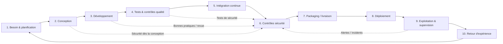

# Cycle de vie DevSecOps — Collector.shop

**Responsable :** Seydou — Lead Dev  
**Contributeurs principaux :** Nouhaila — DevOps, Oumou — Sécurité  
**Branche :** `feat/seydou-lead-dev`

## Objectif

Les consignes demandent de schématiser le cycle de vie du développement logiciel en démarche Dev(Sec)Ops et d’expliquer les phases de développement, tests, intégration, déploiement, monitoring et maintenance.

Le principe retenu est d’intégrer la sécurité et la qualité dans tout le cycle, et non de les vérifier uniquement à la fin.

## Schéma du cycle de vie

## Description des phases

### 1. Besoin et planification
Le Product Owner transforme les attentes métier en besoins priorisés et critères d’acceptation. Le Lead Dev, l’Architecte, le DevOps et la Sécurité vérifient très tôt les impacts techniques et non fonctionnels.

### 2. Conception
L’Architecte définit les composants, responsabilités et interactions. Le Lead Dev s’assure que la conception reste cohérente avec les exigences de qualité. La Sécurité participe aux choix qui touchent les comptes, paiements, données personnelles, chat, modération et fraude.

### 3. Développement
Les développeurs implémentent les fonctionnalités dans des branches dédiées. Le travail est relu avant intégration afin de réduire les défauts et de garder un code maintenable.

### 4. Tests et contrôles qualité
Les changements sont vérifiés avant intégration. Les types de tests exacts seront détaillés dans la tâche DevOps, conformément aux consignes CESI.

### 5. Intégration continue
Chaque changement proposé vers la branche commune déclenche le pipeline CI/CD. Le pipeline doit automatiser au maximum les contrôles avant livraison.

### 6. Contrôles sécurité
Les scans et contrôles de sécurité sont intégrés dans le cycle. Leur sélection technique sera précisée dans la partie Sécurité / DevOps.

### 7. Packaging / livraison
Une version validée est préparée de manière reproductible afin d’être déployée dans l’environnement cible.

### 8. Déploiement
La version est déployée via le processus défini par l’équipe DevOps. L’environnement managé / orchestrateur sera présenté séparément dans le projet.

### 9. Exploitation et supervision
L’application et l’infrastructure sont supervisées. Les erreurs, alertes, comportements anormaux et incidents alimentent l’analyse de l’équipe.

### 10. Retour d’expérience et amélioration continue
Les informations issues de la production et des démonstrations reviennent vers le backlog. Les corrections et améliorations sont priorisées pour recommencer le cycle.

## Règles DevSecOps retenues pour le projet

- Pas de développement directement sur `main`.
- Une branche dédiée par responsable / domaine.
- Pull Request avant intégration.
- Contrôles automatisés dans le pipeline lorsque cela est possible.
- Sécurité intégrée dès la conception et dans le pipeline.
- Tests positionnés avant le déploiement.
- Supervision après déploiement.
- Retour d’expérience systématique pour l’amélioration continue.

## Responsabilités dans le cycle

| Phase | Responsable principal | Contributions |
|---|---|---|
| Besoin / priorisation | Roger — PO | Seydou, Yvan, Nouhaila, Oumou |
| Conception | Yvan — Architecte | Seydou, Oumou, Nouhaila |
| Développement / intégration | Seydou — Lead Dev | développeurs, Nouhaila |
| CI/CD / déploiement | Nouhaila — DevOps | Seydou, Oumou |
| Sécurité | Oumou — Sécurité | toute l’équipe |
| Validation fonctionnelle | Roger — PO | Seydou |
| Supervision / amélioration | Nouhaila + Oumou | Seydou, Roger, Yvan |

## Synthèse pour le PPT

**Slide proposée — “Cycle DevSecOps Collector.shop”**

Présenter le schéma Mermaid sous forme graphique puis expliquer :

**Besoin → Conception → Développement → Tests → CI → Sécurité → Livraison → Déploiement → Monitoring → Amélioration continue**

Message clé : **la qualité et la sécurité ne sont pas des étapes finales ; elles accompagnent tout le cycle de vie.**
