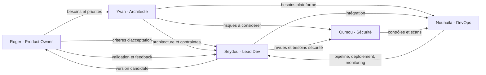

# Métiers et interactions — Collector.shop

**Responsable :** Seydou — Lead Dev

## Objectif
Les consignes CESI demandent d'identifier les métiers clés nécessaires au développement et au déploiement de Collector.shop, de les définir et d'expliquer leurs interactions.

## Organisation du groupe

| Membre | Rôle principal | Responsabilité |
|---|---|---|
| Seydou | Lead Dev | Cohérence technique, qualité logicielle, cycle DevSecOps et intégration des contributions. |
| Nouhaila | DevOps | CI/CD, déploiement, orchestrateur, intégration des tests et monitoring. |
| Yvan | Architecte | Architecture macroscopique, composants, interactions et cadrage des choix techniques. |
| Oumou | Sécurité | Politique de sécurité, risques, scans, supervision sécurité et incidents. |
| Roger | Product Owner | Besoins fonctionnels, périmètre V1, priorisation et critères d'acceptation. |

## Métiers clés

### Product Owner / MOA
Porte la vision métier, clarifie les besoins, priorise le backlog et valide que la solution répond au besoin.

### Architecte logiciel / SI
Structure l'application en composants cohérents, définit leurs responsabilités et veille au respect des exigences fonctionnelles et non fonctionnelles.

### Lead Developer
Garantit la cohérence technique de l'implémentation, définit les standards de développement, coordonne les contributions et accompagne leur intégration.

### Développeur
Implémente les fonctionnalités, participe aux tests et aux revues de code et corrige les défauts.

### DevOps
Automatise l'intégration, les contrôles et le déploiement ; prépare l'environnement d'exécution et la supervision technique.

### Sécurité / DevSecOps
Identifie les risques, définit les contrôles de sécurité, accompagne les choix de conception et intègre les contrôles dans le cycle de développement.

## Matrice d'interactions

| Sujet | PO | Architecte | Lead Dev | DevOps | Sécurité |
|---|---|---|---|---|---|
| Besoins fonctionnels | **Pilote** | Consulte | Consulte | Informé | Consulte |
| Exigences non fonctionnelles | Consulte | **Pilote** | **Co-pilote** | Consulte | **Co-pilote** |
| Architecture | Consulte | **Pilote** | Co-construit | Consulte | Consulte |
| Standards de développement | Informé | Consulte | **Pilote** | Consulte | Consulte |
| CI/CD | Informé | Consulte | Co-construit | **Pilote** | Co-construit |
| Tests | Valide les critères métier | Consulte | Co-construit | **Pilote l'intégration** | Co-construit |
| Sécurité | Consulte | Consulte | Consulte | Co-construit | **Pilote** |
| Déploiement | Informé | Consulte | Consulte | **Pilote** | Consulte |
| Monitoring / incidents | Informé | Consulte | Consulte | **Co-pilote** | **Co-pilote** |
| Validation fonctionnelle | **Pilote** | Informé | Co-valide | Informé | Informé |

## Schéma d'interactions

## Mode de décision
- Le **PO** pilote le besoin métier et les priorités fonctionnelles.
- L'**Architecte** pilote la structure globale de la solution.
- Le **Lead Dev** garantit la cohérence technique d'implémentation.
- Le **DevOps** pilote l'automatisation, la livraison et le déploiement.
- La **Sécurité** pilote les exigences et contrôles de sécurité.
- Toute décision ayant un impact sur plusieurs domaines est discutée collectivement avant intégration.

## Synthèse PPT
Présenter les cinq membres et leur rôle, puis montrer le flux :

**PO → Architecture → Lead Dev → CI/CD / DevOps**, avec **Sécurité transverse sur tout le cycle**.

Message clé : chacun possède un périmètre clair, mais les rôles collaborent afin d'éviter les décisions isolées.