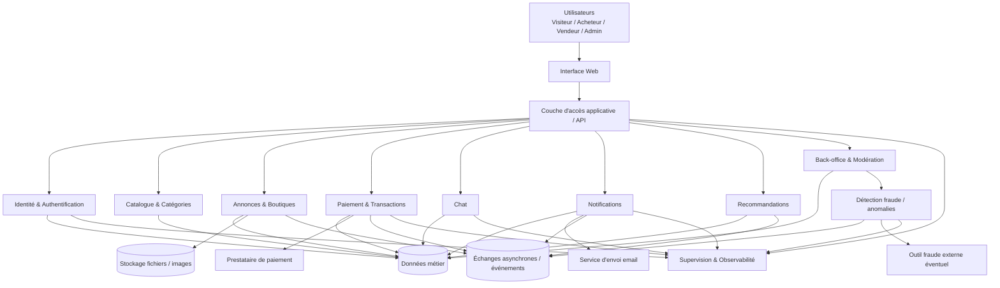

# Architecture macroscopique — Collector.shop

**Responsable :** Yvan — Architecte  
**Branche :** `feat/yvan-architecture`

## Objectif

Les consignes demandent un schéma macroscopique permettant d'identifier les principaux composants de Collector.shop et leurs interactions **avant de choisir les technologies précises**.

Le schéma ci-dessous reste donc volontairement indépendant des frameworks, bases de données, protocoles et fournisseurs.

## Schéma logique

## Lecture du schéma

### 1. Interface Web
Point d'entrée des utilisateurs. Elle affiche le catalogue, les espaces personnels, les boutiques, le chat et le back-office selon les droits.

### 2. Couche d'accès applicative / API
Point de passage entre l'interface et les services métier. Elle orchestre les appels vers les différents composants sans concentrer toute la logique métier dans un seul bloc.

### 3. Identité & Authentification
Gère l'inscription, la connexion, les rôles et les droits d'accès des visiteurs, acheteurs, vendeurs et administrateurs.

### 4. Catalogue & Catégories
Expose les articles consultables et les catégories. Le catalogue reste accessible sans authentification.

### 5. Annonces & Boutiques
Gère les boutiques virtuelles, la création d'annonces, les photos, descriptions, prix, frais de port et le statut de validation avant publication.

### 6. Paiement & Transactions
Gère les achats, transactions, commission de 5 % et échanges avec le prestataire de paiement. Les paiements directs entre acheteur et vendeur ne sont pas autorisés.

### 7. Chat
Permet les échanges entre acheteur et vendeur dans la plateforme, avec des contrôles destinés à limiter le partage de coordonnées personnelles.

### 8. Notifications
Produit et distribue les notifications internes ou email : nouveaux articles, centres d'intérêt, changements de prix et autres événements utiles.

### 9. Recommandations
Utilise les centres d'intérêt de l'acheteur pour proposer des articles. L'architecture doit pouvoir accueillir plus tard une recommandation enrichie par le parcours du catalogue.

### 10. Back-office & Modération
Permet à l'administrateur de gérer les catégories, modérer les annonces et vendeurs, contrôler les publications et superviser les informations utiles à la lutte contre la fraude.

### 11. Détection fraude / anomalies
Reçoit des informations comme les variations de prix ou comportements suspects afin de permettre une analyse automatisée ou l'intégration d'un outil externe.

### 12. Données métier
Stocke les données structurées liées aux utilisateurs, articles, boutiques, transactions, historique, préférences, notifications et autres données fonctionnelles.

### 13. Stockage fichiers / images
Stocke les photos des articles et autres fichiers qui ne doivent pas être conservés directement dans les données métier.

### 14. Échanges asynchrones / événements
Permet de découpler les traitements qui n'ont pas besoin d'être exécutés immédiatement dans le même appel, par exemple notification après publication ou analyse d'un changement de prix.

### 15. Supervision & Observabilité
Centralise les informations nécessaires au suivi de l'état de l'application, des erreurs, incidents et comportements anormaux.

## Principes d'architecture retenus

- séparation claire des responsabilités ;
- sécurité intégrée dès la conception ;
- composants suffisamment indépendants pour faciliter l'évolution ;
- possibilité d'intégrer des services externes sans refonte globale ;
- traitements asynchrones lorsque cela réduit le couplage ;
- observabilité transverse ;
- capacité à faire évoluer progressivement l'application.

## Important

Ce schéma **ne choisit volontairement aucune technologie précise**. Les frameworks, SGBD, protocoles, solutions d'authentification ou outils de messaging seront étudiés séparément.

## Synthèse PPT

**Slide proposée : “Architecture macroscopique Collector.shop”**

À l'oral, expliquer le parcours principal :

**Utilisateur → Interface Web → API → Services métier → Données / services externes**

Puis insister sur trois points :
1. sécurité et authentification séparées ;
2. paiement, chat et fraude isolés car sensibles ;
3. architecture pensée pour accueillir de nouvelles fonctionnalités sans tout reconstruire.