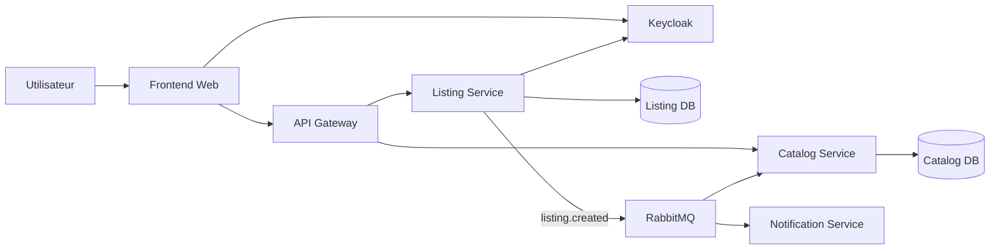

# Architecture technique microservices — Collector.shop

## Statut

Ce document complète l'architecture macroscopique fonctionnelle. Le premier schéma logique reste volontairement indépendant des technologies ; ce second schéma décrit le **prototype technique microservices réellement implémenté**.

## Vue d'ensemble

## Responsabilités

### Frontend
Interface utilisateur. Il n'appelle pas directement les microservices métier : les appels API passent par l'API Gateway.

### API Gateway
Point d'entrée backend unique. Il route les demandes vers Catalog Service ou Listing Service et transmet notamment le jeton d'authentification.

### Catalog Service
Possède la représentation publique du catalogue. Il lit et écrit uniquement dans sa base `collector_catalog`. Il consomme l'événement `listing.created` pour projeter une nouvelle annonce dans le catalogue.

### Listing Service
Possède les annonces créées par les utilisateurs. Il lit et écrit uniquement dans `collector_listing`. Il valide les JWT Keycloak pour les opérations privées et publie `listing.created` après création.

### Notification Service
Consomme l'événement `listing.created` et produit une notification de démonstration. Il ne dépend pas directement de Listing Service.

### RabbitMQ
Broker de messages. Il découple Listing Service de Catalog Service et Notification Service.

### Keycloak
Fournisseur d'identité et d'autorisation. Les rôles `USER` et `ADMIN` restent utilisés.

## Propriété des données

Principe retenu : **database per service**.

| Service | Données possédées |
|---|---|
| Catalog Service | `collector_catalog` |
| Listing Service | `collector_listing` |
| Notification Service | aucune base persistante dans le prototype |
| API Gateway | aucune donnée métier |

Les services Catalog et Listing n'accèdent jamais directement à la base de l'autre.

## Communication

Communication synchrone :
- Frontend → API Gateway ;
- API Gateway → Catalog Service ;
- API Gateway → Listing Service ;
- Listing Service → Keycloak/JWKS pour vérifier les jetons.

Communication asynchrone :
- Listing Service → RabbitMQ : `listing.created` ;
- RabbitMQ → Catalog Service ;
- RabbitMQ → Notification Service.

## Scénario démonstratif

1. un visiteur consulte le catalogue via Gateway → Catalog Service ;
2. un utilisateur se connecte avec Keycloak ;
3. il crée une annonce via Gateway → Listing Service ;
4. Listing Service enregistre l'annonce dans sa propre base ;
5. Listing Service publie `listing.created` ;
6. Catalog Service consomme l'événement et met à jour sa projection ;
7. Notification Service consomme également l'événement ;
8. le nouveau produit devient visible dans le catalogue.

## Limites assumées du prototype

Cette architecture prouve le découpage microservices, la propriété des données, la communication synchrone/asynchrone et l'authentification distribuée. Elle ne prétend pas encore fournir tous les microservices de la plateforme finale (paiement, chat, fraude, recommandations, modération complète).
