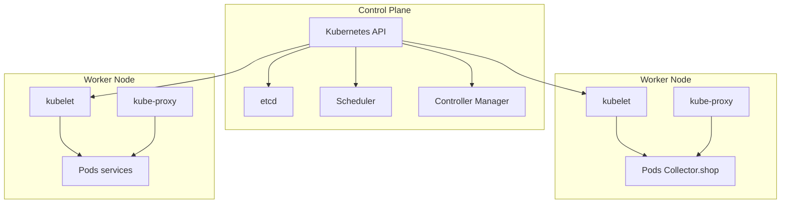

# Environnement managé / orchestrateur — Kubernetes

**Responsable :** Nouhaila — DevOps  
**Contribution architecture :** Yvan

## Choix

Pour répondre à la consigne demandant de présenter un environnement managé et les composants d'un orchestrateur, l'équipe retient **Kubernetes** comme modèle d'orchestration.

Pour les démonstrations locales, **Kind** est proposé comme environnement léger de travail. Kind n'est pas ici une seconde technologie à comparer : il sert uniquement à exécuter localement un cluster Kubernetes de démonstration.

## Schéma logique

## Composants à expliquer à l'oral

### Control Plane
Pilote l'état du cluster et décide où les charges doivent s'exécuter.

### API
Point de contrôle utilisé pour demander et consulter l'état des ressources.

### etcd
Conserve l'état de configuration du cluster.

### Scheduler
Choisit sur quel nœud exécuter une charge.

### Controller Manager
Compare l'état souhaité à l'état réel et déclenche les actions nécessaires pour les rapprocher.

### Worker Nodes
Machines ou nœuds qui exécutent réellement les charges applicatives.

### kubelet
Agent du nœud chargé de faire fonctionner les workloads demandés.

### kube-proxy
Participe à la connectivité réseau des services sur le nœud.

### Pods
Unités d'exécution dans lesquelles les composants du prototype seront lancés.

## Utilisation prévue pour Collector.shop

Le prototype pourra être découpé au minimum en :
- application/API ;
- service d'identité ;
- base de données de démonstration ;
- éventuellement frontend séparé.

L'objectif pédagogique n'est pas de construire une plateforme de production complète, mais de montrer le fonctionnement général de l'orchestration et du déploiement.

## Observabilité prévue

Le pipeline et l'environnement devront fournir au minimum :
- logs applicatifs ;
- statut de santé de l'application ;
- visibilité sur le statut des workloads ;
- éléments suffisants pour expliquer comment une supervision plus complète serait ajoutée.
