# Pipeline cible — Collector.shop

**Responsable :** Nouhaila — DevOps

## Objectif

Définir la chaîne d'intégration et de livraison qui sera utilisée pour le prototype Collector.shop et reproduite autant que possible dans GitHub Actions et Jenkins.

## Schéma cible

```mermaid
flowchart LR
    A[Commit / Pull Request] --> B[Checkout]
    B --> C[Installation dépendances]
    C --> D[Lint / qualité]
    D --> E[Tests unitaires]
    E --> F[Tests intégration]
    F --> G[Scans sécurité]
    G --> H[Build]
    H --> I[Packaging / image]
    I --> J[Déploiement environnement test]
    J --> K[Smoke tests]
    K --> L[Validation]
```

## Règles

- un échec sur une étape bloquante arrête le pipeline ;
- aucun déploiement ne doit être considéré comme valide si les tests obligatoires échouent ;
- les scans de sécurité sont intégrés avant la livraison ;
- la branche `main` représente l'état intégré du projet ;
- les changements passent par Pull Request ;
- le pipeline sera enrichi progressivement à mesure que le prototype sera développé.

## Étapes détaillées

### 1. Checkout
Récupération de la version exacte du dépôt correspondant au commit testé.

### 2. Installation des dépendances
Préparation de l'environnement nécessaire à l'application et aux tests.

### 3. Lint / qualité
Détection des erreurs de style, incohérences ou défauts statiques simples.

### 4. Tests unitaires
Validation des fonctions ou composants isolés.

### 5. Tests d'intégration
Validation des interactions entre composants, par exemple API et base de données.

### 6. Scans de sécurité
Position réservée aux scans de dépendances, secrets, code ou images. Les outils exacts seront définis avec la tâche Sécurité.

### 7. Build
Construction de la version exécutable du prototype.

### 8. Packaging
Création d'un artefact ou d'une image de conteneur reproductible.

### 9. Déploiement test
Déploiement dans un environnement local ou de démonstration.

### 10. Smoke tests
Vérification rapide que les points essentiels répondent après déploiement.

## Évolution du pipeline

### Phase actuelle
Le dépôt contient surtout la documentation et les schémas. Le pipeline initial peut donc seulement vérifier la structure du dépôt.

### Après création du prototype
Les étapes réelles de dépendances, tests, build, conteneur et déploiement seront activées.

### Avant la soutenance
Le même scénario minimal devra être montré avec GitHub Actions et Jenkins.
